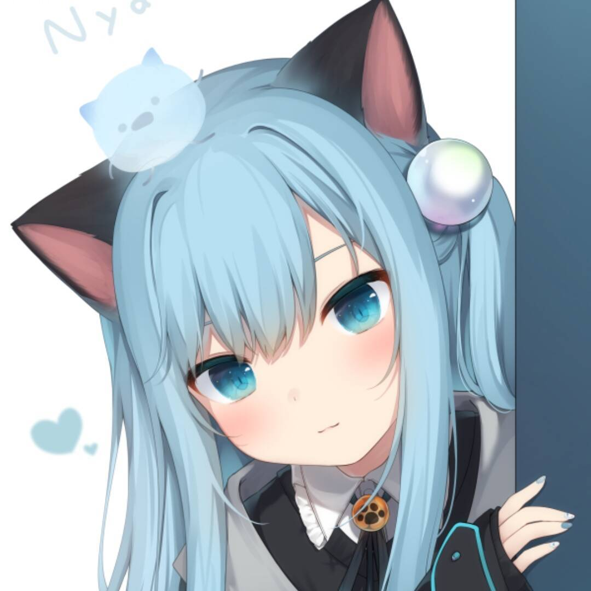

<div align="center">

<!-- Avatar -->


### Hi there, I'm **Euler Rap** (connectedGraph) 👋

> INTP &bull; Project-Driven Learner &bull; Full-Stack AI Application Developer &bull; AI in Education (AIED)

<!-- Social Badges -->
<a href="https://6767.chat"></a>
<a href="https://blog.6767.chat"></a>
<a href="https://github.com/connectedGraph"></a>
<a href="https://x.com/EulerRap"></a>
<a href="https://www.zhihu.com/people/bmmdkp"></a>

<br/>
<br/>

<!-- Hero Terminal Card -->


</div>

---

<!-- Tech Stack Section -->
<br/>

<br/>

<div align="center">

| Category | Technologies |
| :--- | :--- |
| **Frontend** |      |
| **Backend & DB** |     |
| **AI & Dev Tools** |    |

</div>

---

<!-- Projects Section -->
<br/>

<br/>

| Project | Status | Description |
| :--- | :--- | :--- |
| [**Zhihu Immersive Reader**](https://6767.chat/zhihu-immersive-reader/) |  | Immersive reading script for Zhihu, featuring ad-blocking, AI summaries, and Markdown exports. |
| [**Sanguosha Voice & Lines**](https://6767.chat/sgs) |  | Interactive quote library for Sanguosha game, featuring dialogue search, audio playback, and admin panel. |
| [**AIED DuoGrow SaaS**](https://github.com/connectedGraph/AIED-DuoGrow-SaaS) |  | Lightweight web application for parent-child English learning with AI-driven feedback loops. |
| [**BrightlyPk**](https://github.com/connectedGraph/BrightlyPk) |  | Node.js + WebSocket powered real-time trivia competition platform. |
| [**Deepseek Unofficial API**](https://github.com/connectedGraph/Deepseek-unofficial-API) |  | Node.js library wrapper for Deepseek Expert Mode. |

---

<!-- Public APIs Section -->
<br/>

<br/>

> Open endpoints available for public use ✨

```http
GET  https://6767.chat/api/tts-proxy/google   → Google TTS proxy
POST https://6767.chat/api/tts-proxy/mimo     → MiMo TTS proxy
POST https://6767.chat/api/speech-score       → Youdao speech assessment proxy
```

Explore the interactive API documentation at:
👉 **[6767.chat/api/docs](https://6767.chat/api/docs)**

---

<!-- GitHub Stats Section -->
<br/>

<br/>

<div align="center">
  
</div>

<br/>

<div align="center">
  <table border="0" cellpadding="0" cellspacing="0" width="100%" style="max-width: 800px;">
    <tr>
      <td valign="top" width="50%" style="padding-right: 10px;">
        
      </td>
      <td valign="top" width="50%" style="padding-left: 10px;">
        
      </td>
    </tr>
  </table>
</div>

---

<!-- Roadmap Section -->
<br/>

<br/>

```text
Now  → Navigation Refactor: Upgrading homepage from a simple link tree to a full projects dashboard
Next → Status Automation: Integrating GitHub & API health checks directly into the homepage
Later→ Documentation & Portals: Launching public guides for SGS, Shizuku, and AIED projects
```

---

<!-- Ask Me Anything Section -->
<br/>

<br/>

> My homepage integrates personal notes, blogs, and custom knowledge bases. Feel free to ask Claude about me directly!

<div align="center">
  <a href="https://6767.chat/#about"></a>
</div>

<br/>
<br/>

<div align="center">
  <em>Built with ❤️ by Euler Rap (connectedGraph) &bull; 6767.chat</em>
</div>
