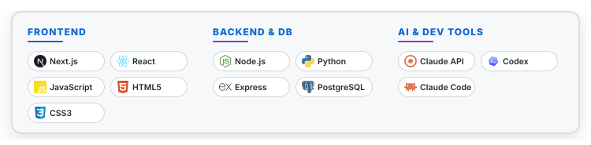
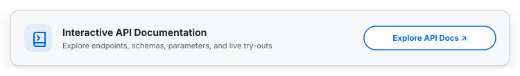

<div align="center">

<!-- Avatar -->
<picture>
  <source media="(prefers-color-scheme: dark)" srcset="./dark/avatar_animated.svg">
  
</picture>

### Hi there, I'm **Euler Rap** (connectedGraph) 👋

> INTP &bull; Project-Driven Learner &bull; Full-Stack AI Application Developer &bull; AI in Education (AIED)

<picture>
  <source media="(prefers-color-scheme: dark)" srcset="./dark/thinking_header.svg">
  
</picture>

<!-- Social Badges -->
<a href="https://6767.chat"><picture><source media="(prefers-color-scheme: dark)" srcset="./dark/badge_website.svg"></picture></a>
<a href="https://blog.6767.chat"><picture><source media="(prefers-color-scheme: dark)" srcset="./dark/badge_blog.svg"></picture></a>
<a href="https://github.com/connectedGraph"><picture><source media="(prefers-color-scheme: dark)" srcset="./dark/badge_github.svg"></picture></a>
<a href="https://qm.qq.com/q/ULGA0Myeo8"><picture><source media="(prefers-color-scheme: dark)" srcset="./dark/badge_qq.svg"></picture></a>
<a href="https://www.zhihu.com/people/bmmdkp"><picture><source media="(prefers-color-scheme: dark)" srcset="./dark/badge_zhihu.svg"></picture></a>

<br/>
<br/>

<!-- Hero Terminal Card -->
<picture>
  <source media="(prefers-color-scheme: dark)" srcset="./dark/typewriter.svg">
  
</picture>

</div>

---

<!-- Tech Stack Section -->
<br/>
<picture>
  <source media="(prefers-color-scheme: dark)" srcset="./dark/header_tech_stack.svg">
  
</picture>
<br/>

<div align="center">
  <picture>
    <source media="(prefers-color-scheme: dark)" srcset="./dark/tech_stack.svg">
    
  </picture>
</div>

---

<!-- Projects Section -->
<br/>
<picture>
  <source media="(prefers-color-scheme: dark)" srcset="./dark/header_projects.svg">
  
</picture>
<br/>

<div align="center">
  <picture>
    <source media="(prefers-color-scheme: dark)" srcset="./dark/projects.svg">
    
  </picture>
</div>

---

<!-- Public APIs Section -->
<br/>
<picture>
  <source media="(prefers-color-scheme: dark)" srcset="./dark/header_public_apis.svg">
  
</picture>
<br/>

> Open endpoints available for public use ✨

```http
GET  https://6767.chat/api/tts-proxy/google   → Google TTS proxy
POST https://6767.chat/api/tts-proxy/mimo     → MiMo TTS proxy
POST https://6767.chat/api/speech-score       → Youdao speech assessment proxy
```

<br/>
<div align="center">
  <a href="https://6767.chat/api/docs">
    <picture>
      <source media="(prefers-color-scheme: dark)" srcset="./dark/api_docs.svg">
      
    </picture>
  </a>
</div>

---

<!-- GitHub Stats Section -->
<br/>
<picture>
  <source media="(prefers-color-scheme: dark)" srcset="./dark/header_stats.svg">
  
</picture>
<br/>

<div align="center">
  <picture>
    <source media="(prefers-color-scheme: dark)" srcset="https://github-readme-activity-graph.vercel.app/graph?username=connectedGraph&theme=tokyo-night&hide_border=true&area=true">
    
  </picture>
</div>

<br/>

<div align="center">
  <table border="0" cellpadding="0" cellspacing="0" width="100%" style="max-width: 800px;">
    <tr>
      <td valign="top" width="50%" style="padding-right: 10px;">
        <picture>
          <source media="(prefers-color-scheme: dark)" srcset="https://github-profile-summary-cards.vercel.app/api/cards/profile-details?username=connectedGraph&theme=tokyonight">
          
        </picture>
      </td>
      <td valign="top" width="50%" style="padding-left: 10px;">
        <picture>
          <source media="(prefers-color-scheme: dark)" srcset="https://streak-stats.demolab.com?user=connectedGraph&theme=tokyonight&hide_border=true&background=1a1b26&ring=7aa2f7&fire=f7768e&currStreakLabel=a9b1d6">
          
        </picture>
      </td>
    </tr>
  </table>
</div>

---

<!-- Roadmap Section -->
<br/>
<picture>
  <source media="(prefers-color-scheme: dark)" srcset="./dark/header_roadmap.svg">
  
</picture>
<br/>

```text
Now  → Navigation Refactor: Upgrading homepage from a simple link tree to a full projects dashboard
Next → Status Automation: Integrating GitHub & API health checks directly into the homepage
Later→ Documentation & Portals: Launching public guides for SGS, Shizuku, and AIED projects
```

---

<!-- Ask Me Anything Section -->
<br/>
<picture>
  <source media="(prefers-color-scheme: dark)" srcset="./dark/header_ask_me.svg">
  
</picture>
<br/>

> My homepage integrates personal notes, blogs, and custom knowledge bases. Feel free to ask Claude about me directly!

<div align="center">
  <a href="https://6767.chat/#about"></a>
</div>

<br/>
<br/>

<div align="center">
  <em>Built with ❤️ by Euler Rap (connectedGraph) &bull; 6767.chat</em>
</div>
